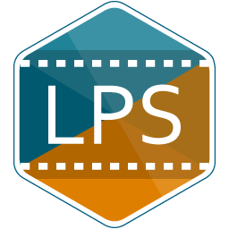
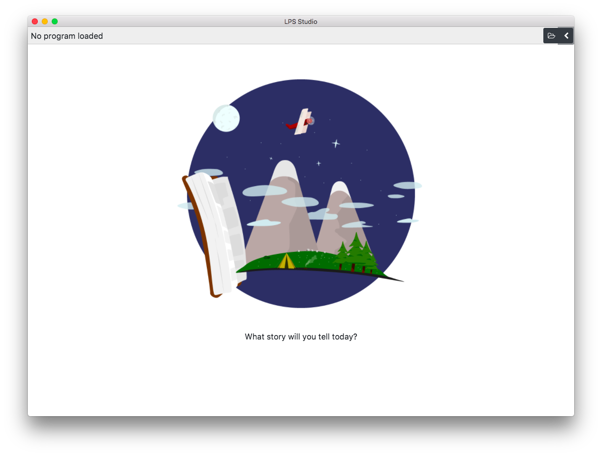

# LPS Studio



LPS Studio is a visualisation and simulation tool for running LPS programs using the [lps.js](https://github.com/mauris/lps.js) interpreter, built using Electron framework and Angular.



## Setup

To setup for development, ensure you have Node.js and npm installed on your system. After cloning this repository, install all dependencies using:

```
npm install
```

Once all dependencies are installed, you can run an instance of LPS Studio by running the command:

```
npm run electron:local
```

## Packaging

To package LPS Studio for distribution, you will need to run one of the following commands:

- For Windows: `npm run electron:windows`
- For macOS: `npm run electron:mac`
- For Linux (AppImage and Debian): `npm run electron:linux`

## License

LPS Studio is open source and licensed under the BSD 3-Clause. The implementation depends on the LPS runtime [lps.js](https://github.com/mauris/lps.js) and several other open source . lps.js was implemented as part of Sam Yong's MSc Computer Science Individual Project and thesis at Imperial College London in 2018.

Images and illustrations in this repository, otherwise explicitly stated, are made by Sam Yong and are licensed under CC BY-NC-SA 3.0.
